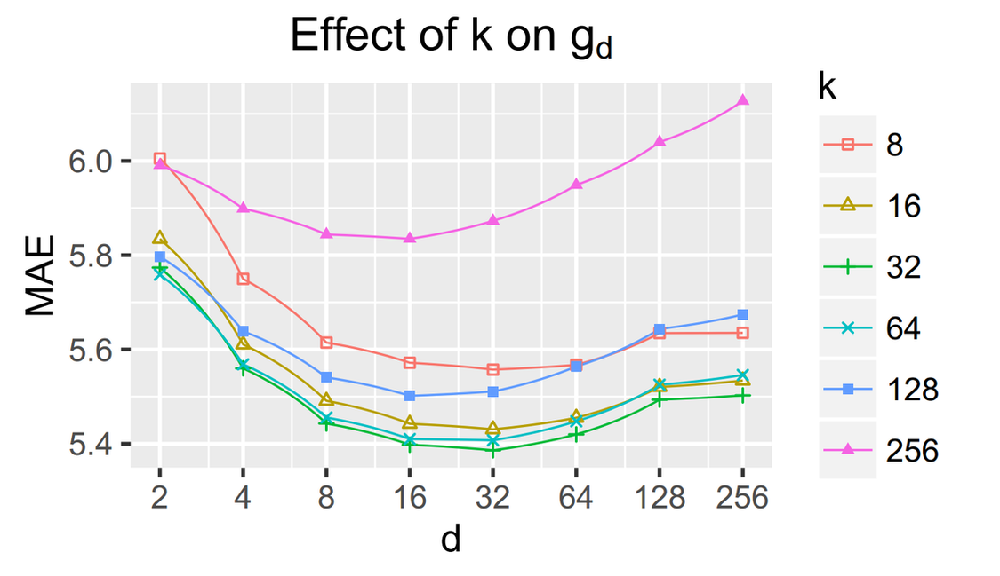
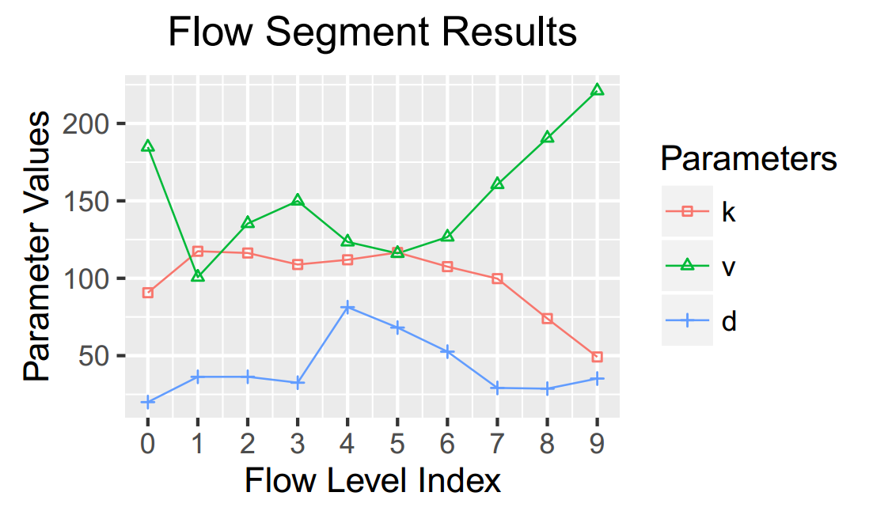
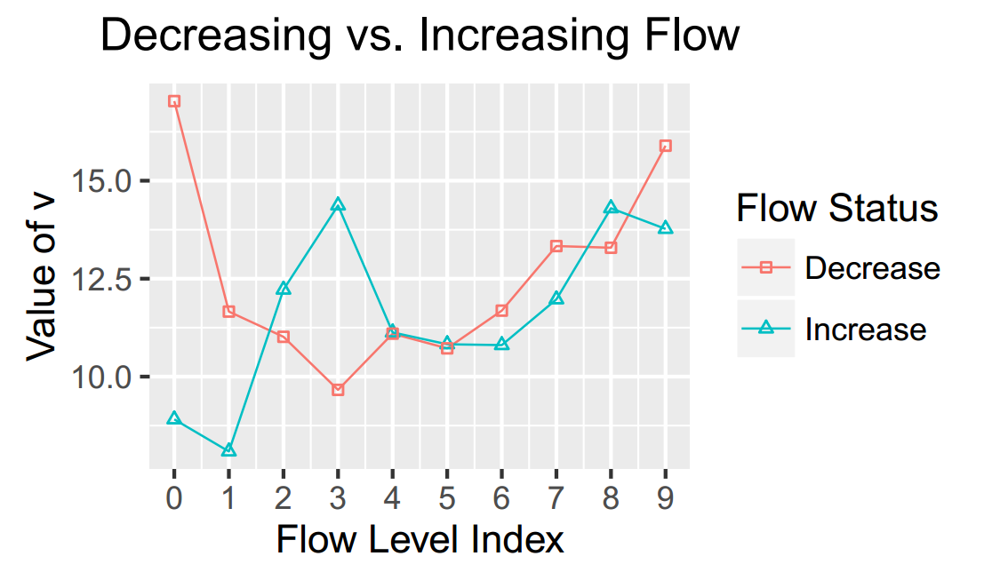
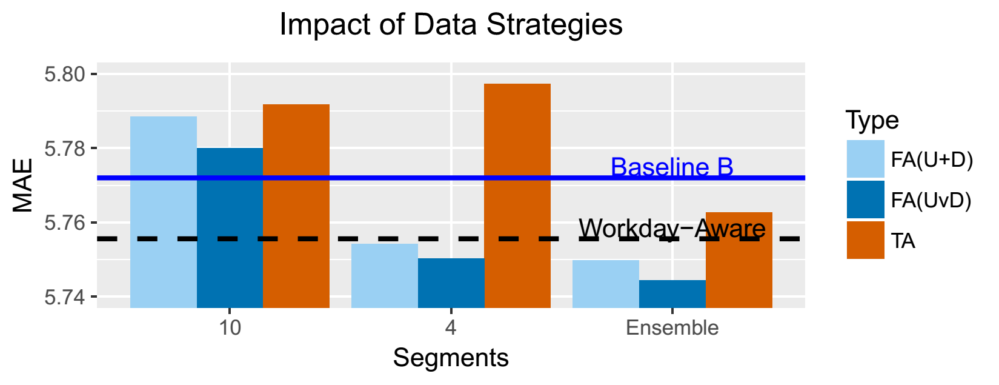

# An Overview of Parameter and Data Strategies for k-Nearest Neighbours Based Short-Term Traffic Prediction
We examine the relations among three k NN parameters, which are:
number of nearest neighbours (*k*), search step length (*d*) and window size (*v*). 
We also analysed predict step ahead (*m*) which is not a parameter but a user requirement and configuration.


# Usage of Code
(The code will be updated.)


# Results
The analyses indicate that the relations among parameters are compound especially when traffic low states are considered.
We suggest considering all parameter strategies simultaneously as ensemble strategies especially by including *v* together with *k* and *d* in flow-aware strategies









# Citation Request
**[IEEE Format]** B. Sun, W. Cheng, P. Goswami, and G. Bai, “An Overview of Parameter and Data Strategies for k-Nearest Neighbours Based Short-Term Traffic Prediction,” in ACM International Conference Proceeding Series ICITT/ICSET 2017, vol. 133326, ACM, 2017, pp. 68--74.

**[AAA Format]** Sun, Bin, Wei Cheng, Prashant Goswami, and Guohua Bai 2017An Overview of Parameter and Data Strategies for K-Nearest Neighbours Based Short-Term Traffic Prediction. In ACM International Conference Proceeding Series ICITT/ICSET 2017 Pp. 68--74. ACM.

**[GB/T 7714-2005]** SUN B, CHENG W, GOSWAMI P等. An Overview of Parameter and Data Strategies for k-Nearest Neighbours Based Short-Term Traffic Prediction[G]//ACM International Conference Proceeding Series ICITT/ICSET 2017. ACM, 2017, 133326: 68--74.


**[BibLatex]:**

```tex

@incollection{sun2017overview,
  title = {An {{Overview}} of {{Parameter}} and {{Data Strategies}} for K-{{Nearest Neighbours Based Short}}-{{Term Traffic Prediction}}},
  volume = {133326},
  url = {http://dx.doi.org/10.1145/3157737.3157749},
  booktitle = {{{ACM International Conference Proceeding Series ICITT}}/{{ICSET}} 2017},
  publisher = {{ACM}},
  author = {Sun, Bin and Cheng, Wei and Goswami, Prashant and Bai, Guohua},
  year = {Sep.-Oct. 2017},
  pages = {68--74}
}

```

# Paper
The full-text paper is available on [Github](https://github.com/SunnyBingoMe/sun2017overview-github-public), [Diva](http://urn.kb.se/resolve?urn=urn:nbn:se:bth-15210) and [ResearchGate](https://www.researchgate.net/publication/316940475_An_Overview_of_Parameter_and_Data_Strategies_for_k-Nearest_Neighbours_Based_Short-Term_Traffic_Prediction).

